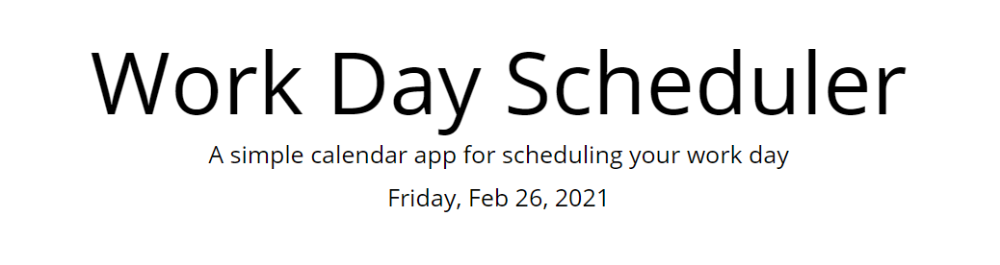
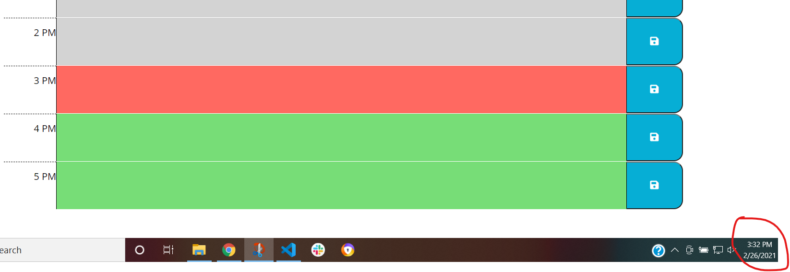
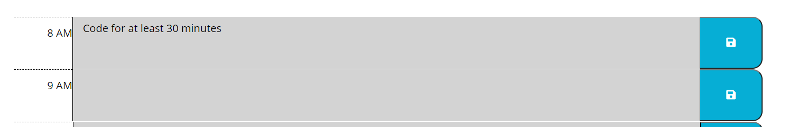

# Work Day Scheduler

https://kristenpicard.github.io/Work-Day-Scheduler/

## Description 

In this project I created a work-day scheduler.

Features of the scheduler that I included:
1. In the header I wanted the current day and date to display.  I used Moment.js to accomplish this.

2. I created blocks for each hour of the work day (8AM to 5PM).

3. The hours are color coded to signify whether they are in the past (grey background), present (red background), or future (green background).

4. Each hour is a text block where the user can type in their activities.

5. When the user types in their to-dos, they can click the corresponding save button and the text they typed will be saved when they reload or leave and then navigate back to the page.

This screenshot shows the header with the date:
 

This screenshot shows the time as 3:32 pm and how the color coding appears based on that time:
 

This screenshot shows the capability of the user to type in information and the save button associated:
 
